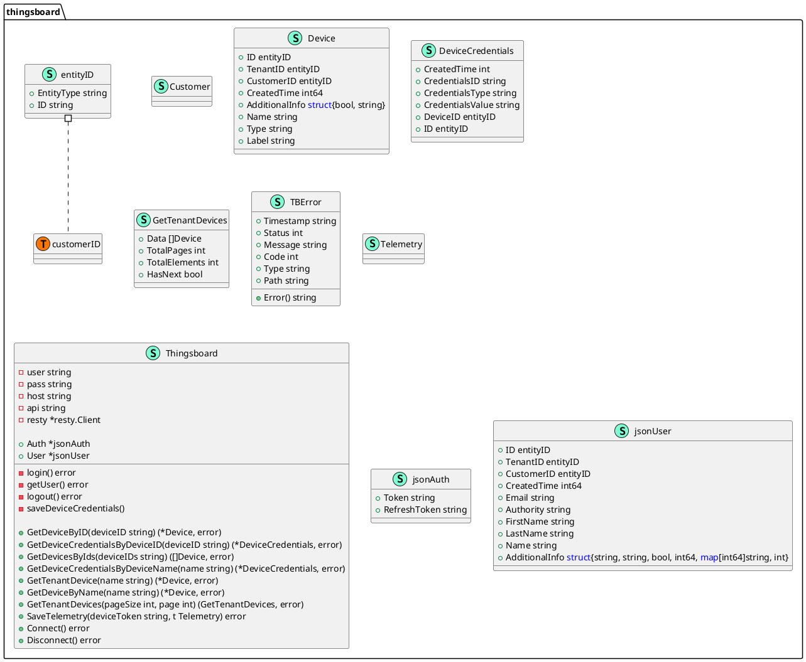

```plantuml
@startuml
namespace thingsboard {
    class Customer << (S,Aquamarine) >> {
    }
    class Device << (S,Aquamarine) >> {
        + ID entityID
        + TenantID entityID
        + CustomerID entityID
        + CreatedTime int64
        + AdditionalInfo <font color=blue>struct</font>{bool, string}
        + Name string
        + Type string
        + Label string

    }
    class DeviceCredentials << (S,Aquamarine) >> {
        + CreatedTime int
        + CredentialsID string
        + CredentialsType string
        + CredentialsValue string
        + DeviceID entityID
        + ID entityID

    }
    class GetTenantDevices << (S,Aquamarine) >> {
        + Data []Device
        + TotalPages int
        + TotalElements int
        + HasNext bool

    }
    class TBError << (S,Aquamarine) >> {
        + Timestamp string
        + Status int
        + Message string
        + Code int
        + Type string
        + Path string

        + Error() string

    }
    class Telemetry << (S,Aquamarine) >> {
    }
    class Thingsboard << (S,Aquamarine) >> {
        - user string
        - pass string
        - host string
        - api string
        - resty *resty.Client

        + Auth *jsonAuth
        + User *jsonUser

        - login() error
        - getUser() error
        - logout() error
        - saveDeviceCredentials() 

        + GetDeviceByID(deviceID string) (*Device, error)
        + GetDeviceCredentialsByDeviceID(deviceID string) (*DeviceCredentials, error)
        + GetDevicesByIds(deviceIDs string) ([]Device, error)
        + GetDeviceCredentialsByDeviceName(name string) (*DeviceCredentials, error)
        + GetTenantDevice(name string) (*Device, error)
        + GetDeviceByName(name string) (*Device, error)
        + GetTenantDevices(pageSize int, page int) (GetTenantDevices, error)
        + SaveTelemetry(deviceToken string, t Telemetry) error
        + Connect() error
        + Disconnect() error

    }
    class entityID << (S,Aquamarine) >> {
        + EntityType string
        + ID string

    }
    class jsonAuth << (S,Aquamarine) >> {
        + Token string
        + RefreshToken string

    }
    class jsonUser << (S,Aquamarine) >> {
        + ID entityID
        + TenantID entityID
        + CustomerID entityID
        + CreatedTime int64
        + Email string
        + Authority string
        + FirstName string
        + LastName string
        + Name string
        + AdditionalInfo <font color=blue>struct</font>{string, string, bool, int64, <font color=blue>map</font>[int64]string, int}

    }
    class thingsboard.customerID << (T, #FF7700) >>  {
    }
}


"thingsboard.entityID" #.. "thingsboard.customerID"
@enduml
```
